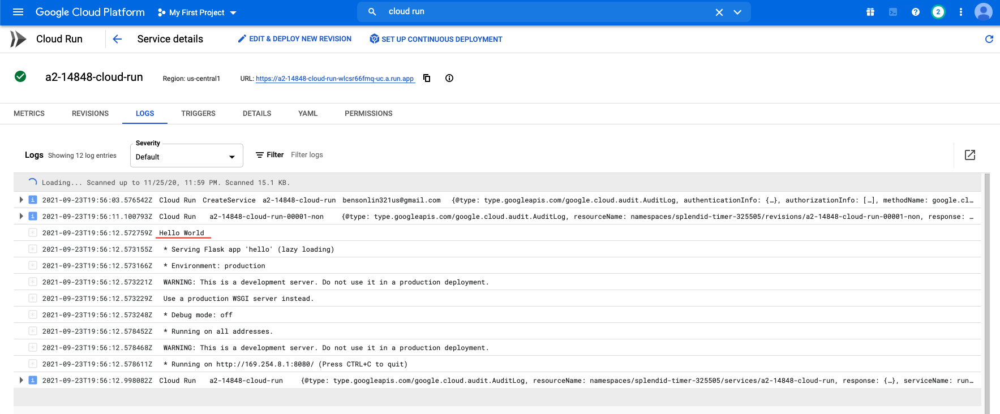

# 14848_Cloud_Infra_HW2

## URL for the Docker image that is uploaded to my Docker Hub account
- https://hub.docker.com/r/shihsunl/14848_cloud_infra_a2

## 

## Deploy the container to Google Cloud Platform Cluster and run the container on the GCP cluster.
- GCP Cloud Run

## Jupyter notebook from MMLSpark
- Jupyter notebook web

- Command for launching Jupyter notebook

## Deploy the first docker container to Kubernetes cluster and deploy the Kubernetes cluster to the GCP cluster
- Kubernetes output

- Kubernetes cluster

